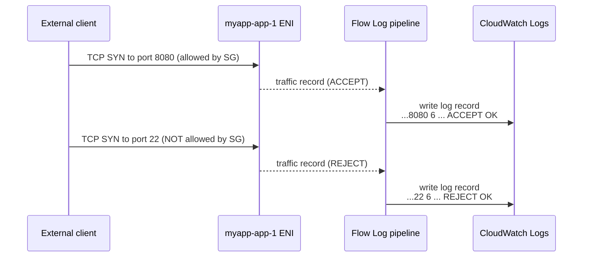

# 20 - VPC Flow Logs

> Goal: understand what VPC Flow Logs capture (and what they **don't**), the three capture scopes, the three destinations, how to read a flow log record, and how to use flow logs to troubleshoot "why can't my instance connect" alongside Security Groups and NACLs — the two firewall layers that actually decide whether traffic is allowed.

---

## 1. What are VPC Flow Logs?

**VPC Flow Logs** capture **metadata about IP traffic** going to and from network interfaces (ENIs) in your VPC — things like source/destination IP, ports, protocol, byte counts, and whether the traffic was allowed or blocked.

> ⚠️ **Flow logs do NOT capture packet contents/payload.** They are metadata only (like a phone bill showing who called whom, for how long — not a recording of the conversation). They also don't capture certain traffic: traffic to/from the Amazon DNS server, DHCP traffic, traffic to the VPC router reserved IP, and a few other special cases.

Use cases: security auditing, intrusion detection input, cost/traffic analysis, and — the most common beginner use — **diagnosing connectivity problems**.

---

## 2. Three capture levels (and how they inherit)

You can enable a flow log at three different scopes:

| Level | What it captures |
|---|---|
| **VPC level** | Every ENI in the entire VPC (all subnets, all instances, all AZs) |
| **Subnet level** | Every ENI in that one subnet only |
| **ENI (Network Interface) level** | Just that one specific network interface |

- Enabling a flow log at the **VPC level** automatically applies it to **every subnet and every ENI** inside that VPC (it "cascades down").
- Enabling at the **subnet level** applies to every ENI in that subnet only.
- You can also target **one specific ENI** for a narrow investigation (e.g. just `myapp-nat-gw`'s ENI) without logging the whole VPC.

🎯 **Exam tip:** "capture traffic for the whole VPC with the least configuration" → enable at the **VPC level**, not one flow log per subnet/instance.

---

## 3. Three destinations — and when to pick each

| Destination | Best for |
|---|---|
| **CloudWatch Logs** | Real-time visibility — set up **CloudWatch Alarms** or run **CloudWatch Logs Insights** queries for ad-hoc investigation right after an incident. |
| **Amazon S3** | Cheap, **long-term storage** for compliance/retention; query later with **Amazon Athena** (SQL over the files) — best for large volumes you don't need to react to instantly. |
| **Kinesis Data Firehose** | Stream flow log records to a **third-party SIEM/analytics tool** (e.g. Splunk, Datadog) in near real time. |

> 🧠 **Mental model:** CloudWatch = "watch it live," S3 = "file it away cheaply for later," Firehose = "pipe it straight to someone else's security tool."

---

## 4. Anatomy of a flow log record

Default flow log record fields, in order:

```
version account-id interface-id srcaddr dstaddr srcport dstport protocol packets bytes start end action log-status
```

**Example — allowed SSH traffic:**

```
2 123456789010 eni-1235b8ca123456789 172.31.16.139 172.31.16.21 20641 22 6 20 4249 1418530010 1418530070 ACCEPT OK
```

| Field | Value | Meaning |
|---|---|---|
| `version` | `2` | Flow log format version |
| `account-id` | `123456789010` | AWS account that owns the ENI |
| `interface-id` | `eni-1235b8ca123456789` | The ENI the traffic passed through |
| `srcaddr` | `172.31.16.139` | Source IP |
| `dstaddr` | `172.31.16.21` | Destination IP |
| `srcport` | `20641` | Source port |
| `dstport` | `22` | Destination port (here: SSH) |
| `protocol` | `6` | IANA protocol number (6 = TCP) |
| `packets` | `20` | Number of packets in this flow capture window |
| `bytes` | `4249` | Number of bytes transferred |
| `start` / `end` | `1418530010` / `1418530070` | Unix timestamps for the capture window |
| `action` | `ACCEPT` | Traffic was **allowed** |
| `log-status` | `OK` | The logging pipeline itself worked (vs `NODATA`/`SKIPDATA`) |

**Example — rejected RDP attempt:**

```
2 123456789010 eni-1235b8ca123456789 172.31.9.69 172.31.9.12 49761 3389 6 20 4249 1418530010 1418530070 REJECT OK
```

Same shape, but `action = REJECT` — this traffic was **blocked**.

You can also request a **custom format** with extra fields such as `vpc-id`, `subnet-id`, `instance-id`, `tcp-flags`, `traffic-path`, and `flow-direction` for deeper analysis.

---

## 5. Using flow logs to troubleshoot "why can't my instance connect?"

A **REJECT** record tells you traffic **was blocked at that ENI** — but flow logs alone don't tell you whether the **Security Group** or the **Network ACL** (Notes 12-14) did the blocking; they only show the net result at the interface.

Practical troubleshooting flow:
1. Look for the expected traffic (e.g. `srcport`/`dstport` 443 from your test client's IP) in the flow log.
2. **No record at all** → traffic never reached the ENI (check the subnet's route table for a missing/misconfigured route, or the NACL, which is stateless and evaluated before the packet is even delivered to the ENI in some cases).
3. **A `REJECT` record exists** → something blocked it at this ENI. Now go check:
   - The instance's **Security Group** inbound rules (stateful — return traffic is automatically allowed, so only the inbound rule for the initiating request matters here).
   - The subnet's **Network ACL** inbound/outbound rules (stateless — remember, you need BOTH directions allowed).
4. Absence of the expected `ACCEPT` record + presence of a `REJECT` confirms *something* in the path is blocking it — flow logs **narrow down** the problem, they don't pinpoint SG vs NACL by themselves.

---

## 6. Step-by-step: enable a Flow Log on `myapp-vpc` to CloudWatch Logs

1. VPC console → **Your VPCs** → select **`myapp-vpc`**.
2. **Flow Logs** tab (bottom panel) → **Create flow log**.
3. **Name**: `myapp-vpc-flow-log`.
4. **Filter**: choose **All** (captures both ACCEPT and REJECT — pick "Reject only" if you just want to hunt for blocked traffic cheaply).
5. **Maximum aggregation interval**: 1 minute (more granular, slightly higher log volume) or 10 minutes (default, cheaper).
6. **Destination**: **Send to CloudWatch Logs**.
7. **Destination log group**: create new → `/vpc/myapp-vpc/flowlogs`.
8. **IAM role**: create/select a role that grants the flow logs service permission to write to CloudWatch Logs (e.g. `myapp-flowlogs-role`).
9. **Create flow log**.
10. Wait a few minutes, generate some traffic (e.g. try to SSH from an IP not allowed by `myapp-web-sg`), then go to **CloudWatch → Log groups → `/vpc/myapp-vpc/flowlogs`** → open the latest log stream (named after the ENI) → find a `REJECT` line matching your test traffic.
11. Optional: run a **CloudWatch Logs Insights** query like:
    ```
    fields @timestamp, srcAddr, dstPort, action
    | filter action = "REJECT"
    | sort @timestamp desc
    ```



---

## 7. Common beginner problems

| Problem | Likely cause / fix |
|---|---|
| No log streams appearing | IAM role for the flow log lacks permission to write to the CloudWatch log group — recheck the role's policy. |
| Log group fills up fast / costs rising | Use a **longer aggregation interval** (10 min), filter to **Reject only**, or switch destination to **S3** for cheaper long-term storage. |
| Can't tell if SG or NACL blocked traffic | Flow logs only show the net **ACCEPT/REJECT** at the ENI — cross-check the SG rules and NACL rules directly to find which one is responsible. |
| Missing expected traffic entirely | Check the subnet's route table and NACLs first — some traffic never reaches the ENI to be logged at all if it's dropped earlier in the path. |

---

## 8. ⚠️ Clean up to avoid charges

- Flow logs sent to **CloudWatch Logs** incur **ingestion and storage charges** — delete the flow log and/or the log group when done practicing.
- Flow logs to **S3** incur standard S3 storage costs — delete the bucket/prefix if not needed.
- Flow logs to **Kinesis Data Firehose** incur Firehose ingestion charges on top of the destination's cost.

---

## 9. Recap

- VPC Flow Logs capture **traffic metadata** (5-tuple + accept/reject + byte/packet counts) at the ENI — **never packet payload**.
- Three capture scopes: **VPC** (cascades to everything), **Subnet**, or a single **ENI**.
- Three destinations: **CloudWatch Logs** (real-time/alerting), **S3** (cheap long-term + Athena), **Kinesis Data Firehose** (stream to a 3rd-party SIEM).
- Record format: `version account-id interface-id srcaddr dstaddr srcport dstport protocol packets bytes start end action log-status`.
- A `REJECT` record proves traffic was blocked at that ENI, but **doesn't say whether it was the Security Group or the NACL** — you still have to check both directly.
- 🎯 **Exam tip:** flow logs are metadata-only and don't capture payload; if the question needs packet **contents**, the answer is **not** flow logs (that would need something like traffic mirroring).
- Next: **Note 21** — Managed Prefix Lists (reusable CIDR lists for SGs and route tables).

---

### Sources
- [Logging IP traffic using VPC Flow Logs – AWS docs](https://docs.aws.amazon.com/vpc/latest/userguide/flow-logs.html)
- [Flow log records – AWS docs](https://docs.aws.amazon.com/vpc/latest/userguide/flow-log-records.html)
- [Flow log record examples – AWS docs](https://docs.aws.amazon.com/vpc/latest/userguide/flow-logs-records-examples.html)
- [Create a flow log that publishes to CloudWatch Logs – AWS docs](https://docs.aws.amazon.com/vpc/latest/userguide/flow-logs-cwl-create-flow-log.html)
