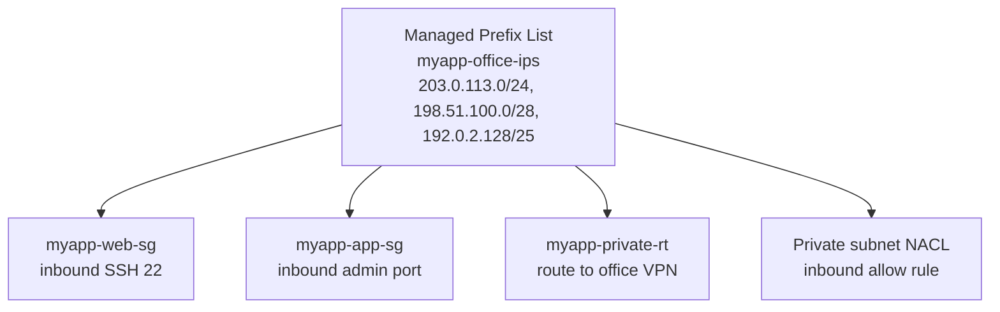

# 21 - Managed Prefix Lists

> Goal: understand what a **managed prefix list** is, the difference between **AWS-managed** and **customer-managed** prefix lists, and how referencing one prefix list in many Security Groups/route tables saves you from updating the same CIDR everywhere by hand. Builds on `myapp-web-sg` from Note 04. Next: continue the folder review / apply everything end-to-end.

---

## 1. The problem: the same CIDR repeated everywhere

Imagine your company has 3 office locations, and you want all of them to be able to SSH into `myapp-web-sg`'s instances. Without prefix lists, you'd add **3 separate inbound rules** (one CIDR each) to `myapp-web-sg`. Now imagine you also need those same 3 office CIDRs allowed in:
- `myapp-app-sg` (for an internal admin port),
- 2 different NACLs,
- a route table for a VPN-routed subnet.

That's the same 3 CIDRs, copy-pasted into **10+ places**. The day one office's IP range changes, you have to hunt down and edit every single one of those rules — easy to miss one and either lock people out or leave a stale, insecure rule behind.

A **Managed Prefix List** solves this: you define the CIDR set **once**, give it a name, and reference that **one object** everywhere instead of the raw CIDRs.

> 🧠 **Mental model:** a prefix list is like a **mailing list alias** (`office-ips@company.com`) instead of typing out 10 individual email addresses every time you send something. Update the alias's membership once, and everything that referenced the alias is instantly correct.

---

## 2. Two kinds of managed prefix list

| | **AWS-managed prefix list** | **Customer-managed prefix list** |
|---|---|---|
| Who creates it | AWS (pre-built, one per service per Region) | You |
| Example | `com.amazonaws.ap-south-1.s3`, `com.amazonaws.ap-south-1.dynamodb` | `myapp-office-ips` |
| Editable? | No — AWS updates it as the service's IP ranges change | Yes — you add/remove/edit entries any time |
| Typical use | Allow traffic to/from an AWS service's published IP ranges in a **NACL** or **route table** (e.g. allowing S3 IP ranges through a NACL without listing every S3 CIDR yourself) | Group **your own** CIDRs (offices, VPNs, partner networks) and reference them in **Security Groups, NACLs, and route tables** |

Both kinds are referenced the exact same way: as a **source/destination** in a Security Group rule, a Network ACL rule, or a **route table** destination — anywhere you'd normally type a CIDR, you can instead pick "Prefix list" and select one.

---

## 3. The big win: update once, apply everywhere

When you edit a **customer-managed prefix list**'s entries (add/remove a CIDR) and save a **new version**, **every Security Group, NACL, and route table that references that prefix list is automatically updated** — no hunting through dozens of resources.

- Each edit creates a new **version number** (v1, v2, v3...) so you can track/audit changes over time.
- You set a **"Max entries"** value **at creation time** — this is the maximum number of CIDRs the list can ever hold. It can be **increased later**, but do so carefully: increasing it changes how much "quota" the prefix list consumes wherever it's referenced (see next section) — a sudden increase could push a Security Group over its rule limit unexpectedly.

---

## 4. ⚠️ Quota gotcha: a prefix list counts as its Max-Entries, not its actual entry count

This is the part beginners miss: when you reference a prefix list inside a **Security Group** or **route table**, it counts against that resource's rule quota using the prefix list's **Max Entries setting** — **not** the number of CIDRs actually in it today.

Example: you create `myapp-office-ips` with **Max entries = 10**, but only add 3 CIDRs today. Referencing it in `myapp-web-sg` still consumes **10 rules' worth** of quota (default SG quota is 60 rules), because AWS reserves room for it to grow up to its max without breaking anything.

🎯 **Exam tip:** the exam sometimes describes an AWS-managed prefix list (like the CloudFront one) "unexpectedly" eating most of a Security Group's 60-rule quota — that's this exact mechanic: the list's **declared max size**, not its live entry count, is what's charged against the quota.

---

## 5. Extending `myapp-vpc`: replace a hardcoded "My IP" with a prefix list

Recall from Note 04: `myapp-web-sg` allows inbound **SSH (22)** from **"My IP"** — a single hardcoded CIDR (e.g. `203.0.113.10/32`). That's fine solo, but breaks the moment:
- You're not the only admin, or
- Your home/office IP changes (common with residential ISPs).

**Before:**

| Type | Port | Source |
|---|---|---|
| SSH | 22 | `203.0.113.10/32` *(hardcoded "My IP")* |

**After** — create a customer-managed prefix list `myapp-office-ips` with your team's real office/VPN exit CIDRs, and reference the prefix list instead:

| Type | Port | Source |
|---|---|---|
| SSH | 22 | **Prefix list: `myapp-office-ips` (pl-xxxxxxxx)** |

Now, adding a new office or a new admin's IP is a **single edit** to `myapp-office-ips` — `myapp-web-sg` (and any other SG/NACL that also references it) updates automatically.

One prefix list, referenced by 4 different resources — update the list once, all 4 stay in sync.

---

## 6. Step-by-step: create and use `myapp-office-ips`

1. VPC console → left nav **Managed Prefix Lists** → **Create prefix list**.
2. **Name**: `myapp-office-ips`.
3. **Max entries**: `10` (leave headroom for future offices — remember this sets the quota consumed wherever it's used).
4. **Address family**: IPv4.
5. **Entries** — add each office CIDR with a description:
   - `203.0.113.0/24` — "Mumbai HQ"
   - `198.51.100.0/28` — "Bengaluru branch office"
   - `192.0.2.128/25` — "Remote VPN exit range"
6. **Create prefix list**. Note its ID, e.g. `pl-0abcd1234efgh5678`, and it starts at **Version 1**.
7. Go to **EC2 console → Security Groups → `myapp-web-sg`** → **Edit inbound rules**.
8. Delete (or edit) the old SSH rule that had `203.0.113.10/32` ("My IP").
9. **Add rule**: Type = SSH, Source type = **Custom** → in the source box, start typing `pl-` and select **`myapp-office-ips`**.
10. **Save rules**.
11. Later, when an office IP changes: **Managed Prefix Lists → myapp-office-ips → Edit entries** → update the CIDR → **Save** (creates Version 2). `myapp-web-sg` picks up the change automatically — no need to touch the security group again.

---

## 7. Common beginner problems

| Problem | Likely cause / fix |
|---|---|
| "Quota exceeded" adding a prefix list to a Security Group | The prefix list's **Max Entries** value pushes the SG over its 60-rule limit — lower Max Entries or request a quota increase for the SG. |
| Updated the prefix list but a route table didn't change | You must **explicitly reference** the prefix list in each resource (SG rule, NACL rule, or route table entry) — creating/editing the list alone doesn't retroactively attach it anywhere. |
| Can't reduce Max Entries after creation | Max Entries can only be **increased**, not decreased, once other resources reference it — plan the initial size with some headroom. |
| Forgot which CIDRs are "live" vs an old edit | Check the prefix list's **Version** history — each save is a new version, useful for audit. |

---

## 8. Recap

- A **managed prefix list** is a named, reusable set of CIDRs you reference in Security Groups, NACLs, and route tables instead of repeating CIDRs everywhere.
- **AWS-managed** prefix lists (e.g. `com.amazonaws.<region>.s3`) are pre-built and maintained by AWS for its own service IP ranges.
- **Customer-managed** prefix lists are ones you create (e.g. `myapp-office-ips`) for your own CIDR groups.
- The big win: **edit the list once, every SG/NACL/route table referencing it updates automatically** — no more hunting down every rule.
- ⚠️ A prefix list consumes quota in each SG/route table equal to its **Max Entries setting**, not its current live entry count — size it carefully at creation.
- We replaced `myapp-web-sg`'s hardcoded "My IP" SSH rule with a reference to `myapp-office-ips`, matching how real teams maintain access as offices/IPs change.
- 🎯 **Exam tip:** "reduce operational overhead of updating the same CIDR in many security groups" → **customer-managed prefix list**.

---

### Sources
- [Managed prefix lists – AWS docs](https://docs.aws.amazon.com/vpc/latest/userguide/managed-prefix-lists.html)
- [Work with customer-managed prefix lists – AWS docs](https://docs.aws.amazon.com/vpc/latest/userguide/work-with-cust-managed-prefix-lists.html)
- [AWS-managed prefix lists – AWS docs](https://docs.aws.amazon.com/vpc/latest/userguide/working-with-aws-managed-prefix-lists.html)
- [Resolve limit exceeded errors for prefix lists – AWS re:Post knowledge center](https://repost.aws/knowledge-center/vpc-limit-exceeded-errors)
